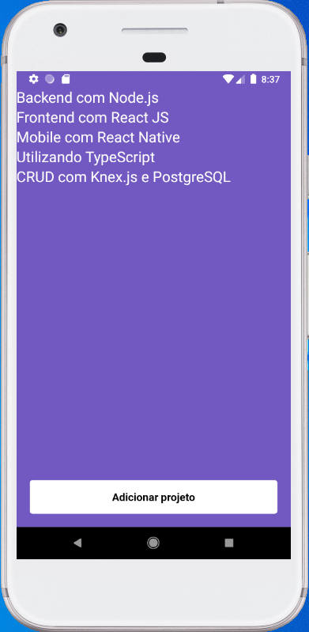

# :iphone: Mobile React Native

A simple project to practice the main concepts of React Native.

It uses a RESTFull API provided by a backend made with Node.js: **[Backend with Node.js](https://github.com/prenato84/backend-node-module)**.

This frontend has a button for adding projects directly into the backend.

Some key React JS and React Native concepts:

- State and Immutability
- UseEffect for loading the list of projects from the backend
- RN components: StatusBar, SafeAreaView, FlayList, TouchableOpacity
- A little bit of Flexbox CSS was used for styling the components

<p align="center">
  
</p>

### :keyboard: Installation and Execution

As this project is only the frontend of the application, it is necessary to install and run the backend project first following the instructions at its own repo: **[Backend with Node.js](https://github.com/prenato84/backend-node-module)**.

With the backend started, now the frontend will be able to make the API's calls.

To install and run the frontend:

- Clone this repo

```
> git clone https://github.com/prenato84/modulo-mobile-react-native
```

- Go inside the project's main folder

```
> cd mobile
```

- Install the dependencies

```
yarn
```

- Start the project with Android

```
# If you have the ract-native-cli installed globally

react-native run-android

# With NPX

npx react-native run-android
```

- Start the project with iOS Simulator (Xcode)

```
# If you have the ract-native-cli installed globally

react-native run-ios

# With NPX

npx react-native run-ios

# For auto starting the simulator

react-native run-ios --simulator="DEVICE_NAME"
```

Notes:

1. If you are using an emulator, make sure that the baseURL at 'src/services/api.js' is using 'http://localhost:3333'
1. If it is a physical device, change the baseURL to 'http://LOCAL_MACHINE_IP:3333'

### :bookmark_tabs: API Description

- **`GET /projects`**: lists all the projects stored in memory.

- **`POST /projects`**: expects to receive an object with `title` and `owner` inside the request body. The created project is stored inside an object like: `{ id: "uuid", title: 'Node.js Project', owner: 'Owner Name'`; The ID is an UUID - Universal Unique Identifier.

- **`PUT /projects/:id`**: expects to receive an object with `title` and `owner` inside the request body and it changes the project info based on the `id` passed as a request param.

- **`DELETE /projects/:id`**: deletes the project that corresponds to the `id` passed as a request param.

### :man_technologist: Requirements

- Javascript interpreter **[Node JS](https://nodejs.org/en/download/)**
- Version control system **[Git](https://git-scm.com/)**

OBS: if you don't want to use Git, you can download the project's zip file directly from the Project's GitHub Page as shown below:

<p align="center">
  
</p>

### :memo: License

This project is under the MIT license.

---

Developed with 💜 by <a href="https://www.linkedin.com/in/prenato84">Paulo Castro</a> :wave:
